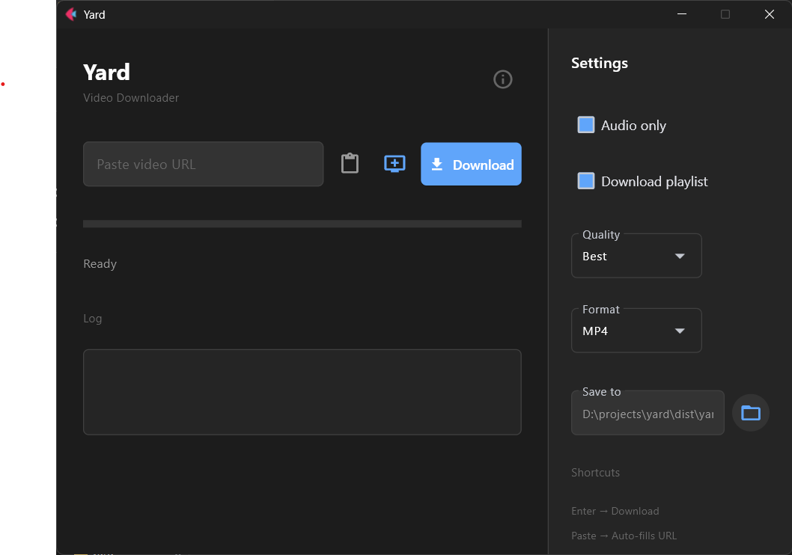

# Yard

**Yet Another yt-dlp** - A simple, fast, and robust video downloader built with Flet.



## Features

- 🎬 **Download videos** from YouTube and 1000+ websites
- 🎵 **Audio extraction** - MP3, M4A, WAV formats
- 📊 **Quality selection** - Best, 1080p, 720p, 480p
- 📦 **Multiple formats** - MP4, MKV, WEBM
- 📋 **Playlist support** - Download entire playlists
- 📂 **Download queue** - Add multiple URLs
- 💾 **Remember settings** - Preferences saved automatically
- 📋 **Auto-paste** - Detects URLs from clipboard on startup
- ⌨️ **Keyboard shortcuts** - Press Enter to download

## Installation

### Download Installer

Download the latest `yard-setup-{version}.exe` installer from [Releases](../../releases).

The installer will:
- Install Yard to your Program Files
- Create Start Menu shortcuts
- Optionally add a desktop icon
- Set up proper uninstaller

### Run from Source

**Requirements:** Python 3.9+

```bash
# Clone the repo
git clone https://github.com/razikdontcare/yard.git
cd yard

# Install dependencies
pip install flet "yt-dlp[default,curl-cffi]" imageio-ffmpeg pyperclip requests packaging

# Run the app
flet run src/main.py
```

### Using uv

```bash
uv run flet run
```

### Using Poetry

```bash
poetry install
poetry run flet run
```

## Building

### Build the Application

```bash
# Using flet build (recommended - creates native Flutter app)
flet build windows -v

# Output: build/flutter/build/windows/x64/runner/Release/
```

### Create Installer

**Requirements:** [Inno Setup](https://jrsoftware.org/isdl.php)

```bash
# After building the app
# Compile the installer script
"C:\Program Files (x86)\Inno Setup 6\ISCC.exe" installer.iss

# Output: installer/yard-setup-{version}.exe
```

Or open `installer.iss` in Inno Setup GUI and click Build > Compile.

## Tech Stack

- **[Flet](https://flet.dev)** - UI Framework (Flutter-based)
- **[yt-dlp](https://github.com/yt-dlp/yt-dlp)** - Download engine
- **[FFmpeg](https://ffmpeg.org)** - Media processing (bundled via imageio-ffmpeg)
- **[Inno Setup](https://jrsoftware.org/isinfo.php)** - Windows installer

## License

MIT

## Author

**Razik** - [GitHub](https://github.com/razikdontcare)
